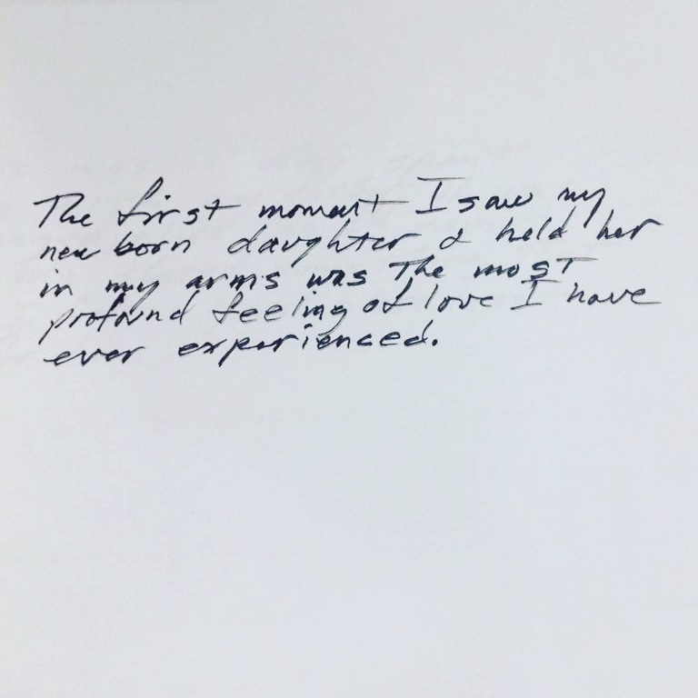
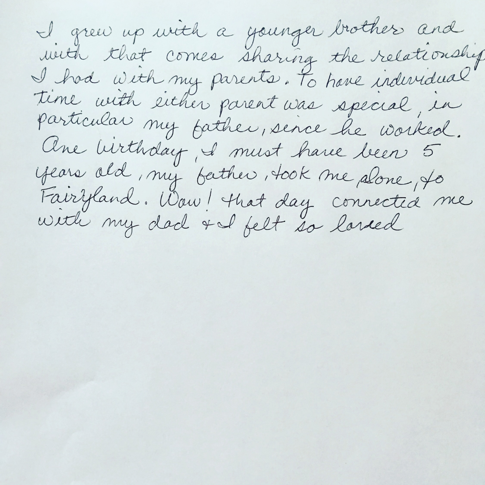
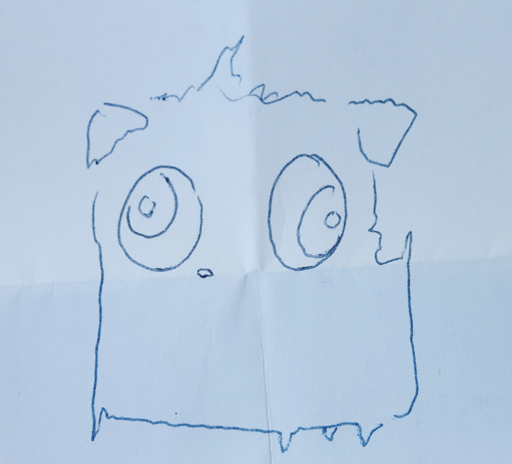
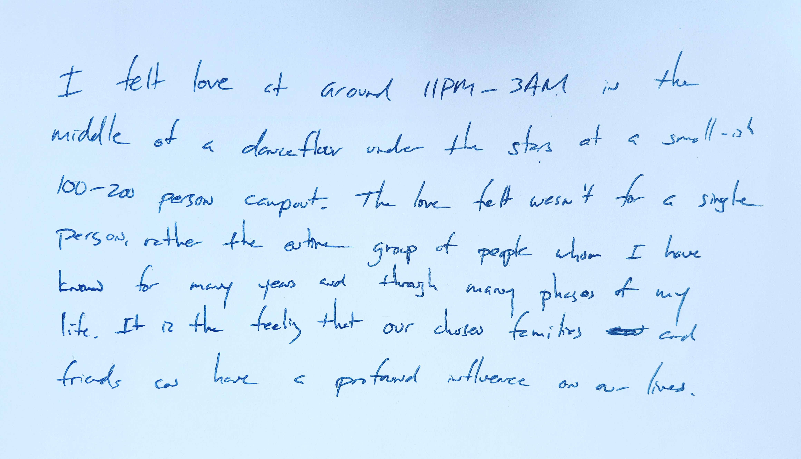
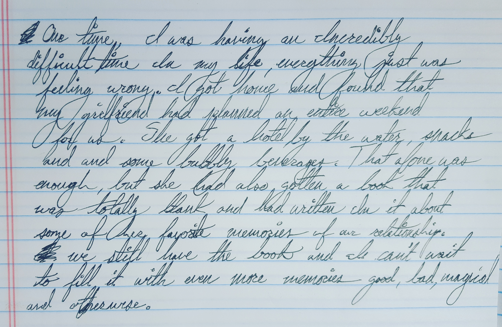

Here's the code for a project called The Giant's Door. (Unfortunately until I can recover the raspberry pi from wherever it is, I probably won't be able to find the final version of the code.)

- [Project Notes](#project-notes)
- [Technical Notes](#technical-notes)
    + [What's missing](#what-s-missing)
- [Personal Notes](#personal-notes)

# Project Notes

Submitted for the [2018 Red Bull Creation build competition](https://makezine.com/2018/07/03/red-bull-creation-returns-high-five-machine-9-crazy-contraptions/), this code was written in 72 hours along with the project that it powered: a large door exploring the concept of human love. The user would be invited to knock on the door. From behind the door, a voice known as the Giant prompted the user to submit a form of a time they experienced love. They'd receive a receipt that contained another submission.

Project consisted of:
* a large door which we outfitted with a knocker and a mailbox
* a raspberry pi
* an accelerometer to detect knocking
* a speaker
* a thermal printer
* a writing desk with printed forms and pens
* an infrared sensor to detect letters falling through the mailbox

Some sample submissions we received (we received these during a test run, and used them as candidates for what would be printed on the receipts for future submissions):
* 
* 
* 
* 
* 
* 

----

# Technical Notes

As you'll notice in the code, it's heavily broken right now. I started running out of time gluing everything together and the welders on my team were telling me they were ready for the gadgets. So I slapped the code onto the pi and started editing straight from there so we could tune the sensors off the Pi without having to wait for deploy. Hopefully that SD card is still out there, but for now I just have this partial snapshot of the project before it was finished.

What this is **supposed** to do:
* powers_out.py runs the main loop. Triggers some random audio every now and then if nothing's playing ("bored" tracks)
* Poll for a knock or a letter.
    * Knocks were read from the accelerometer (hardcoded magic number yeeee) to trigger the intro prompt
    * Letters in the mailbox were read via the infrared sensor by way of an ADC board.
    * One of these was I2C and the other one was SPI if i'm not mistaken... should have probably tracked down this code
      closer to when I wrote it.
* If a letter is submitted, print a receipt and remind the user to collect it. It was fun learning to format thermal paper receipts through CUPS `lp`-- of course at that point we still had 8 whole hours left on the clock. I think there was still a bug that prevented a couple of the files from printing properly that I never managed to track down.
    * Maybe we ended up using [escpos](https://github.com/python-escpos/python-escpos) instead?

Everything else was probably like, systemd, alsamixer/omxplayer, etc. etc.

### What's missing

Code: 

* Honestly the main loop is probably pretty close to the final version but you can see some typos in there
* adc_infrared.py
* accel_code.py

Other:

* There was a systemd unit file but that's pretty trivial 
* I think I hacked in an audio player script too
* We had a bunch of ambience tracks

Finally I found an arduino ino file lying around that may or may not have been used in the final demo.

# Personal Notes

This was probably one of the coolest opportunities to create something I've ever been paid to do. The hosts were obviously instrumental in creating the high pressure environment and putting the teams together. I'm also deeply grateful to my team (a talented crew consisting of me and some extremely talented welders and a very resourceful tinkerer) for concepting and building this wonderful thing, and humbled by the rest of the participants for voting us as "People's Choice"; there's no greater praise than being the favored project among a bunch of other creators. (I think we won a sailing trip because of this too ;)
